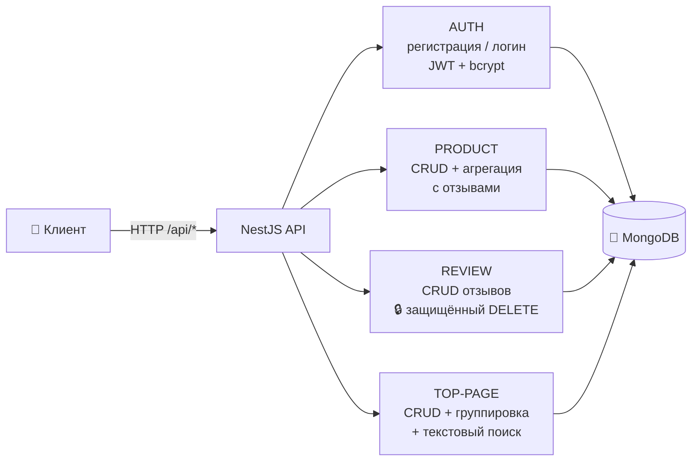

<div align="center">

# 🛍️ Product Reviews API

**REST API для каталога продуктов с отзывами, JWT-авторизацией и SEO-страницами**

Современный бэкенд на **NestJS** + **MongoDB**: CRUD продуктов и отзывов, полнотекстовый поиск, агрегация рейтингов и авторизация по JWT — всё в одном сервисе.

[](https://nestjs.com)
[](https://www.typescriptlang.org)
[](https://www.mongodb.com)
[](https://mongoosejs.com)
[](https://jwt.io)
[](https://www.docker.com)

</div>

---

## ✨ Возможности

- 🔐 **JWT-аутентификация** — регистрация и вход через `passport-jwt`, пароли хешируются `bcryptjs` (соль 10 раундов)
- 🛒 **Управление продуктами** — полный CRUD + расширенный поиск по категории
- ⭐ **Отзывы о продуктах** — создание, удаление (только для авторизованных), привязка к продукту
- 📊 **Агрегация рейтингов** — Mongo-агрегация: количество отзывов, средний рейтинг, сортировка по свежести
- 📄 **Топ-страницы** — CRUD страниц с категориями (Курсы / Сервисы / Книги / Товары), данными hh.ru и SEO-текстами
- 🔎 **Полнотекстовый поиск** — текстовый индекс MongoDB (`$text`) по топ-страницам
- 🧪 **Валидация на уровне DTO** — `class-validator` + `class-transformer`
- 🐳 **Docker-ready** — приложение и MongoDB поднимаются одной командой `docker compose up`
- 🧹 **Кастомный пайп** — проверка валидности `ObjectId` в параметрах маршрутов

## 🛠 Стек технологий

| Технология | Назначение |
|---|---|
| **NestJS 11** | Фреймворк (модули, DI, контроллеры, сервисы) |
| **TypeScript 5.7** | Язык разработки |
| **MongoDB + Mongoose 9** | База данных и ODM |
| **Passport + JWT** | Аутентификация (`Bearer`-токены) |
| **bcryptjs** | Хеширование паролей |
| **class-validator / class-transformer** | Валидация входящих данных |
| **Jest + Supertest** | Unit- и e2e-тесты |
| **Docker / Docker Compose** | Контейнеризация и оркестрация |
| **ESLint + Prettier** | Качество и форматирование кода |

## 🏗 Архитектура



## 📁 Структура проекта

```
api/
├── src/
│   ├── auth/                  # Аутентификация: регистрация, логин, JWT
│   │   ├── dto/auth.dto.ts    #   DTO входа/регистрации
│   │   ├── guards/jwt.guard.ts#   JWT-гард
│   │   ├── strategies/        #   Passport-стратегия JWT
│   │   └── user.model.ts      #   Схема пользователя
│   ├── product/               # Продукты: CRUD + поиск с агрегацией
│   │   ├── dto/               #   Create/Find DTO
│   │   └── product.model.ts   #   Схема продукта
│   ├── review/                # Отзывы: CRUD, привязка к продукту
│   │   ├── dto/               #   CreateReviewDto
│   │   └── review.model.ts    #   Схема отзыва
│   ├── top-page/              # Топ-страницы: CRUD, поиск, группировка
│   │   ├── dto/               #   Create/TopPageDto
│   │   └── top-page.model.ts  #   Схема топ-страницы
│   ├── users/                 # Сервис пользователей
│   ├── common/base.schema.ts  # Общие поля (createdAt/updatedAt)
│   ├── configs/               # Конфигурации Mongo и JWT
│   ├── decorators/            # Кастомный декоратор UserEmail
│   ├── pipes/                 # Пайп валидации ObjectId
│   ├── app.module.ts          # Корневой модуль
│   └── main.ts                # Точка входа (префикс /api)
├── test/                      # E2E-тесты (auth, review)
├── compose.yaml               # Docker Compose: mongo + app
├── Dockerfile
└── package.json
```

## 🚀 Быстрый старт

### Требования

- **Node.js** ≥ 22 (рекомендуется 26) и npm
- **MongoDB** 4.4+ — локально или через Docker

### 1. Локальный запуск

```bash
# установка зависимостей
npm install

# запуск в режиме разработки (watch)
npm run start:dev

# обычный запуск
npm run start

# production-сборка
npm run build && npm run start:prod
```

Сервер поднимется на **http://localhost:3000/api**.

### 2. Запуск через Docker

```bash
# сборка и запуск app + MongoDB
docker compose up --build
```

| Сервис | Порт (хост) |
|---|---|
| API (контейнер `my_node_app`) | `8080 → 3000` |
| MongoDB (контейнер `mongo`) | `27017` |

## ⚙️ Переменные окружения

Создайте файл `.env` в корне проекта:

```env
MONGO_LOGIN=admin          # логин пользователя MongoDB
MONGO_PASSWORD=admin       # пароль пользователя MongoDB
MONGO_HOST=localhost       # хост MongoDB
MONGO_PORT=27017           # порт MongoDB
MONGO_AUTHDATABASE=admin   # база для аутентификации
JWT_SECRET=your_secret     # секрет для подписи JWT-токенов
```

## 🔌 API Endpoints

Все маршруты доступны под префиксом **`/api`**.

### 🔐 Auth

| Метод | Маршрут | Описание | Доступ |
|---|---|---|---|
| `POST` | `/api/auth/register` | Регистрация нового пользователя | Публичный |
| `POST` | `/api/auth/login` | Вход, возвращает `access_token` | Публичный |
| `GET` | `/api/auth/all` | Список всех пользователей | Публичный |

**Тело запроса** (`register` / `login`):

```json
{ "login": "user@mail.ru", "password": "secret123" }
```

**Ответ `login`:**

```json
{ "access_token": "eyJhbGciOiJIUzI1NiIs..." }
```

### 🛒 Product

| Метод | Маршрут | Описание | Доступ |
|---|---|---|---|
| `POST` | `/api/product/create` | Создать продукт | Публичный |
| `GET` | `/api/product/:id` | Получить продукт по ID | Публичный |
| `PATCH` | `/api/product/:id` | Обновить продукт | Публичный |
| `DELETE` | `/api/product/:id` | Удалить продукт | Публичный |
| `POST` | `/api/product/find` | Найти продукты по категории **с отзывами** | Публичный |

**Пример поиска с агрегацией:**

```bash
curl -X POST http://localhost:3000/api/product/find \
  -H "Content-Type: application/json" \
  -d '{"category": "electronics", "limit": 5}'
```

В ответе каждый продукт получает `reviewCount`, `reviewAvg` и отсортированные по дате `reviews`.

### ⭐ Review

| Метод | Маршрут | Описание | Доступ |
|---|---|---|---|
| `POST` | `/api/review/create` | Создать отзыв | Публичный |
| `DELETE` | `/api/review/:id` | Удалить отзыв | 🔒 Требуется JWT |
| `GET` | `/api/review/byProduct/:productId` | Все отзывы по продукту | Публичный |
| `GET` | `/api/review/all` | Все отзывы | Публичный |

**Тело запроса** (`create`):

```json
{
  "name": "Иван",
  "title": "Отличный товар!",
  "description": "Пользуюсь месяц, всё нравится",
  "rating": 5,
  "productId": "66f0e2c0a1b2c3d4e5f6a7b8"
}
```

> Рейтинг валидируется в диапазоне **1–5**.

### 📄 Top-Page

| Метод | Маршрут | Описание | Доступ |
|---|---|---|---|
| `POST` | `/api/top-page/create` | Создать страницу | Публичный |
| `GET` | `/api/top-page/:id` | Получить страницу по ID | Публичный |
| `GET` | `/api/top-page/byAlias/:alias` | Получить страницу по alias | Публичный |
| `PATCH` | `/api/top-page/:id` | Обновить страницу | Публичный |
| `DELETE` | `/api/top-page/:id` | Удалить страницу | Публичный |
| `POST` | `/api/top-page/findByDto` | Группировка страниц по категории | Публичный |
| `GET` | `/api/top-page/textSearch/:text` | Полнотекстовый поиск | Публичный |

**Категории первого уровня** (`firstLevelCategory`): `Courses` (0) · `Services` (1) · `Books` (2) · `Products` (3)

## 🗄 Модели данных

### User
`email` *(unique)* · `passwordHash` · `createdAt` · `updatedAt`

### Product
`image` · `title` · `price` · `oldPrice?` · `credit` · `description` · `advantages` · `disAdvantages` · `categories[]` · `tags[]` · `characteristics[{name, value}]`

### Review
`name` · `title` · `description` · `rating` (1–5) · `productId` *(ObjectId)* · `createdAt` · `updatedAt`

### TopPage
`firstLevelCategory` *(enum)* · `secondCategory` · `alias` *(unique)* · `title` · `category` · `hh?{count, juniorSalary, middleSalary, seniorSalary}` · `advantages[{title, description}]` · `seoText` · `tags[]` · `tagsTitle` · `createdAt` · `updatedAt`

## 🧪 Тесты

```bash
# unit-тесты
npm run test

# unit-тесты в watch-режиме
npm run test:watch

# покрытие
npm run test:cov

# e2e-тесты
npm run test:e2e
```

## 🛠 Инструменты разработки

```bash
npm run lint    # ESLint (с автоисправлением)
npm run format  # Prettier
npm run build   # сборка в dist/
```

---

<div align="center">

Сделано с ❤️ на [NestJS](https://nestjs.com) · [Документация NestJS](https://docs.nestjs.com)

</div>
